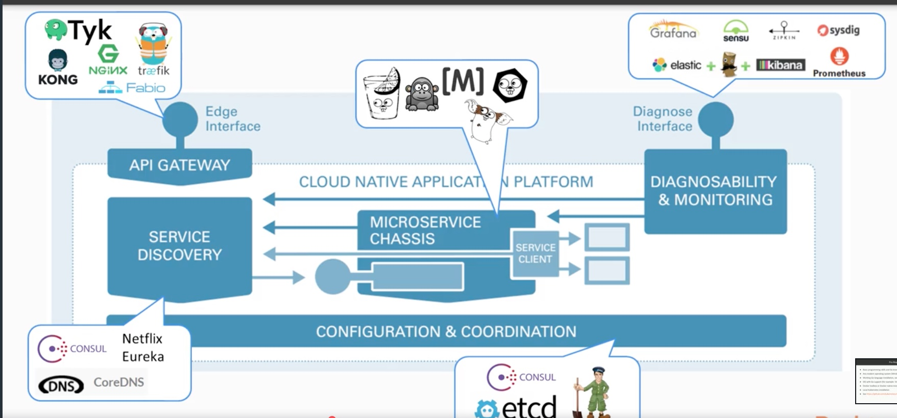

## Cloud Native App Platforms




### Building Blocks and Functions of  Cloud Native Applications

![Cloud Native Application])(CloudNativePlatform.jpeg)

#### Libraries
 * afex/hystrix-go - latency and fault tolerance - https://github.com/afex/hystrix-go
 * grpc/grpc-go  - client/server - https://grpc.io/
 * spacemonkeygo/monkit - metrics, monitoring instrumentation - https://github.com/spacemonkeygo/monkit
  

#### Service Frameworks
* Gizmo - NYT Standardized Configuration/Logging
* GoKit - RPC messaging Asynchronous Messaging
* GoMicro - Service Discovery, Load Balancing 

#### Web Frameworks
* Gorilla - mux router context/cookies

* Gin - API HTTP Rest Framework

### Docker commands
```docker-compose up```
to run in the background

```docker-compose stop
docker tag gin-web:1.0.1 jaynejacobs/gin-web:1.0.1
docker push jaynejacobs/gin-web:1.0.1
docker run -d  jaynejacobs/gin-web:1.0.1```
### Kubernettes Commands
minikube ip
kubectl cluster-info
Kubernetes master is running at https://192.168.99.100:8443
KubeDNS is running at https://192.168.99.100:8443/api/v1/namespaces/kube-system/services/kube-dns:dns/proxy
192.168.99.100 
```sh
kubectl apply -f kubernetes/
kubectl get deployments
NAME      READY   UP-TO-DATE   AVAILABLE   AGE
gin-web   0/2     2            0           87s

kubectl get pods
```
