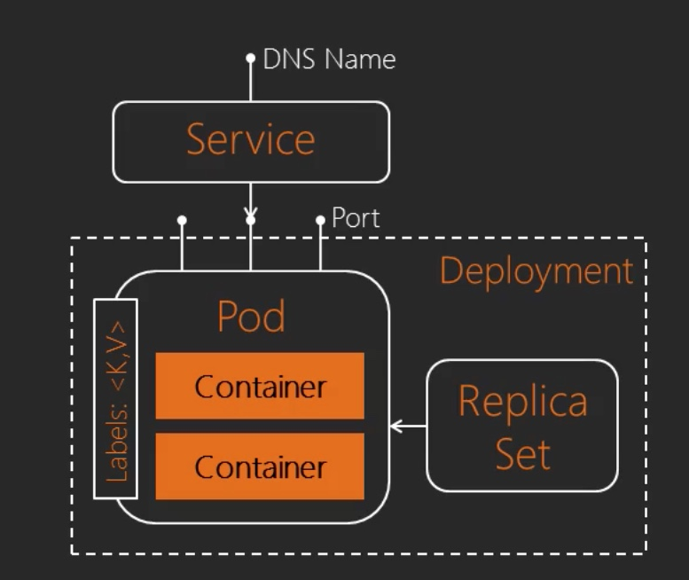
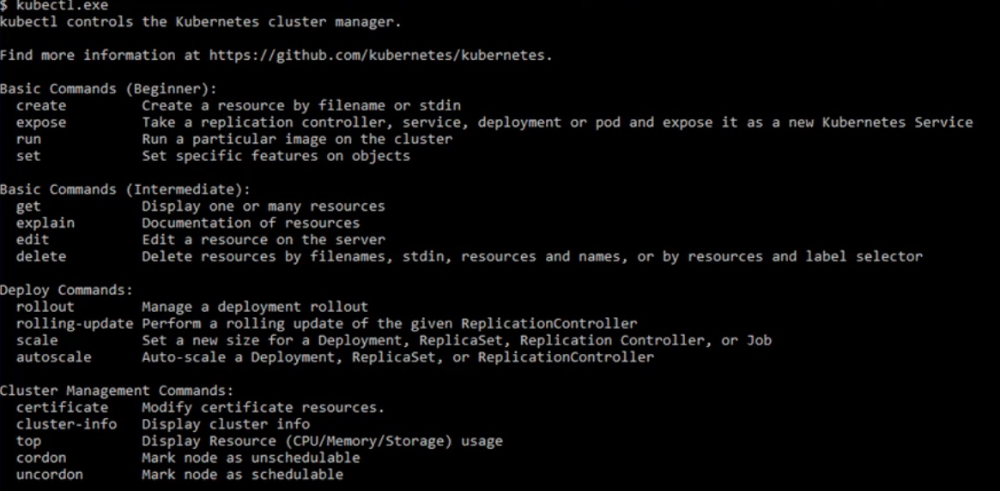

## Kubernetes Architecture


#### Service Abstraction

## Deploy Go microservice locally 

#### Minikube

```sh 
minikube docker-env
```

```
export DOCKER_TLS_VERIFY="1"
export DOCKER_HOST="tcp://192.168.99.101:2376"
export DOCKER_CERT_PATH="/Users/jjacob151/.minikube/certs"
export DOCKER_API_VERSION="1.35"
```
#### Run this command to configure your shell:
```eval $(minikube docker-env)```

```docker images
REPOSITORY                                TAG                 IMAGE ID            CREATED             SIZE
k8s.gcr.io/kube-controller-manager        v1.13.3             0482f6400933        2 weeks ago         146MB
k8s.gcr.io/kube-proxy                     v1.13.3             98db19758ad4        2 weeks ago         80.3MB
k8s.gcr.io/kube-apiserver                 v1.13.3             fe242e556a99        2 weeks ago         181MB
k8s.gcr.io/kube-scheduler                 v1.13.3             3a6f709e97a0        2 weeks ago         79.6MB
k8s.gcr.io/coredns                        1.2.6               f59dcacceff4        3 months ago        40MB
k8s.gcr.io/etcd                           3.2.24              3cab8e1b9802        5 months ago        220MB
k8s.gcr.io/kube-addon-manager             v8.6                9c16409588eb        12 months ago       78.4MB
k8s.gcr.io/pause                          3.1                 da86e6ba6ca1        14 months ago       742kB
gcr.io/k8s-minikube/storage-provisioner   v1.8.1              4689081edb10        15 months ago       80.8MB
```

### Implement Deployment and Service Descriptors

#### [k8-pod.yaml](k8s-pod.yml)


After creating deployment.yaml
```
    kubectl create -f       k8s-deployment.yaml
    kubectl create -f k8s-deployment.yaml
    kubectl get deployments,pods,rs
```
#### After changing the deployment.yaml

``` sh 
    kubectl apply -f k8s-deployment.yaml
    kubectl describe deployment
  ```

#### [Configure service.yml](k8s-service.yml)

```sh
kubectl apply -f k8s-deployment.yaml
kubectl get services'
```

### Scale Deployment and perform Rolling Updates
kubectl create -f k8s-deployment.yaml  --record=true
PASML-335382:~ jjacob151$ kubectl get pods -w
NAME                             READY   STATUS             RESTARTS   AGE
cloudnativego-6c559788b7-b5n4g   0/1     ImagePullBackOff   0          6s
cloudnativego-6c559788b7-r5znl   0/1     ImagePullBackOff   0          6s
kubectl scale deployment cloudnativego --replicas=3
kubectl scale deployment cloudnativego --replicas=5
kubectl scale deployment cloudnativego --replicas=2

